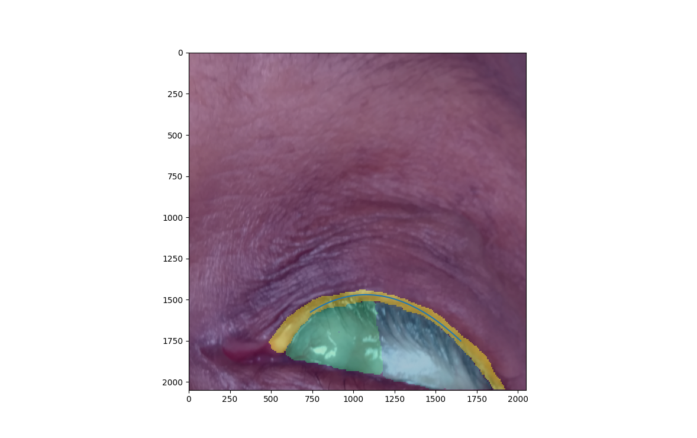

# trachoma
Trachoma prediction from natural images.

## Prediction of label map

Input an rgb image of dimension 256x256. The original input image should be resampled to this size.


```
python3 src/py/predict.py --img input_256.jpg --model ./useg_3labels_256/ --out input_labelmap_256.nrrd
```

## Fit of polynomial to output label

Once the prediction is done, we proceed to generate a stack of images by following the best polynomial fit to the segmented region.
In this case, our region of interest is given by label number 3.
The output from the previous step must be resampled to a higher resolution using nearest neighbor interpolation.


```
python3 src/py/poly_fit.py --img input_2048.jpg --size 512 --label input_labelmap_2048.nrrd --out input_stacked.nrrd
```



## Resampling script included for convenience

Example:

To resample a single image to 256,256 using linear interpolation:
```
python3 src/py/rescale_images.py --img input.jpg --out_dir <path_to_output_directory> --target_size 256 --resample_method 1
```

To resample all nrrd images in a directory to 256,256 using nearest neighborhood interpolation:
```
python3 src/py/rescale_images.py --input_dir <path_to_images> --image_suffix .nrrd --out_dir <path_to_output_directory> --target_size 256 --resample_method 0
```